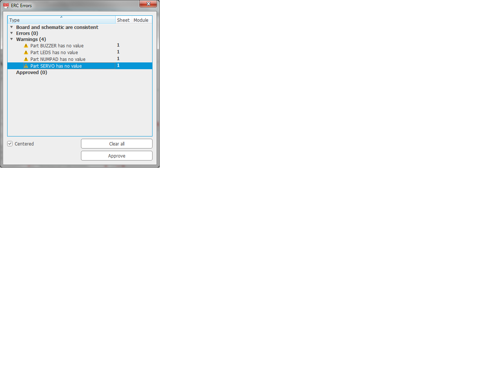

# PCB Design Review
We got feedback on our board layout from a few different teams as well as our TA Eric. We took into account many of the suggestions and implemented them before submitting our CAD file for printing.

# Recommendations:
* Include vias next to all the ground connections for your components
* Check the ATMega chip output pins that are connected to your servo to ensure they are PWM capable
* Label inputs and outputs on schematic
* Correct minor spelling mistakes in description
* Double check DRC errors and warnings (clear up or approve)
  - Errors related to USB port like clearance and missing values should be approved
  

# Compliments:
* The layout looks very good
* Appropriate use of 45-degree angle traces
* Appropriate trace widths
* Good use of vias to have flooded grounds
* Great use of bypass capacitors
* Great understanding of the MVP functionality
* Nice component and block labeling using the silkscreen layer
* Wire traces are consistantly appropriate for chosen application (power, GPIO, etc.)
* Efficient use of top layer, power traces don't bounce between layers
