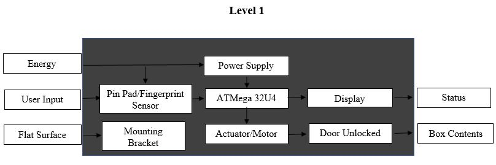

# Product Design Specification (PDS) - Practicum Homework #3

### SeLo SECURITY LOCKER

#### Executive Summary / Concept of Operation**

The SeLo security locker is an affordable, wall-mounted option to store important documents, keys or other personal items. SeLo helps occupy less space than traditional lockboxes, provide sufficient security and ease of access for people of all generations. This security locker can be mounted on the wall, and its owner can setup and open the box using PIN/password/finger print. SeLo will sound an alarm if thieves try wrong passwords or steal the box.

#### Brief Market Analysis
- **Intended customers**: Suitable for people of all ages, those who need a secure place to store important items with more security and not occupy too much space in their house. 
- **Competition**: Compete with all off-the-shelves lockers in the market. What make our SeLo security locker stands out is (1) ease of use, (2) theft detection, (3) use efficient space. 
- **Expected price**: The price for SeLo is around $50. Most off-the-selves lockers are above $100 and they are heavy/use lots of space with unnecessary storage. We believe that $50 is a reasonable price that can cover the part costs while generating profits.

#### Requirements

-  MUST weigh less than 20 lbs
-  MUST be able to access contents within 5 seconds of entering passcode.
-  MUST cost less than $40 to produce
-  MUST be securable to a fixed surface (wall or floor)
-  SHOULD be smaller than 12" x 12" x 5"
-  SHOULD be of rugged construction
-  SHOULD have an backup/alternative method to open
-  SHOULD be able to store at least 4 different passcodes
-  SHOULD be able to easily change or alter PIN/passcode
-  SHOULD sound an alarm after 3 wrong passcode attempts 
-  MAY use a fingerprint sensor to activate lock
-  MAY have a camera to record activity
-  MAY be weather resistant

**System Architecture**

**Design Specification**
- **Sensor:** Pin/Password/FingerPrint/RFID, etc.
- **Proccessor:**  Atmel ATMega32U4 8-bit Microcontroller.
- **Actuator:** Motor, Lock, LEDs, LCD/Display, SHOULD: accelerometer, surveilance camera & speaker.
- **Power:** 5V, may need some resistors.
- **Mechanical design:** SparkFun Motor Driver - Dual TB6612FNG (1A) as a motor to open and close the door.
- **Firmware:** may need software to check whether the Pin/Password or FingerPrint is correct or not.
- **Arduino:** may need to write code in Arduino software.
- **Development environment:** environment safe.

