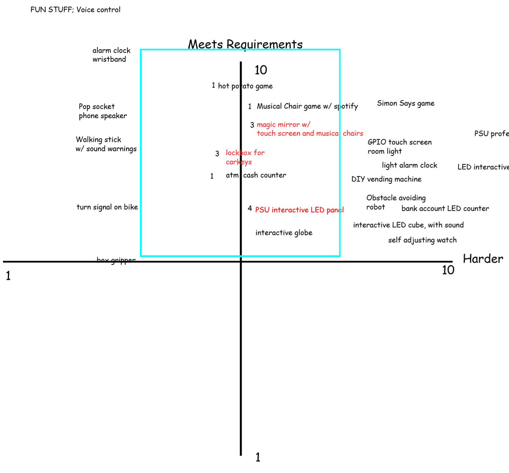

# ECE 411 Practicum Project Ideas

### 1. Interactive Panel for PSU Campus Map
- **Description**: A PSU interactive map is a tool that is intended to show new students and visitors key locations around campus and pertinent information about different buildings and departments. This would be a touch sensitive screen that would rely on users input and then a controller would translate that input to an actuator in the form of a speaker and LED screen changes. This would be the most complex idea on our list and most likely would involve an ATmel chip. To remove complexity, we thought of forgoing the touch screen, but that remove much our the intended functionality and would require a shift in sensor inputs to buttons.
- **Sensor**: touch sensor, buttons, microphone
- **Controller**: Atmel or Raspberry Pi or Arduino
- **Actuator**: LEDs, speaker, and touchscreen.

### 2. Security Locker for Keys/Important Documents
- **Description**: A wall mounted lock box that can be used to store important documents, keys or other personal effects to provide extra security and ease of access. This project will incorporate access control meaning a verification sensor such as a pinpad or RFID sensor to determine if access has been granted to open the lock box. Such a device would consist of four main blocks of operation, a sensor, controller, actuator and housing. We can use a variety of controllers on the market to help facilitate the communication between the sensor and actuator. The actuator will be the locking mechanism that releases the door from the box frame. There are many combinations that may be selected to produce a fully functional project depending on the necessary complexity and features selected. 
- **Sensor**: PIN/Password/Fingerprint/RFID etc.
- **Controller**: Atmel or Raspberry Pi or Arduino
- **Actuator**: Lock, Speaker, LEDs, LCD screens

### 3. Interactive Magic Mirror
- **Description**: A magic mirror that plays music and can display a multitude of data such as weather, humidity, temperature, date, time and much more when a proximity sensor is activated by a user using the mirror. This would involve a LCD screen to me mounted to the backside of a mirror and then shine though and remain visible. As a complex project idea also involving large screens we had brainstrom other options to reduce that difficulty, but similar to the Interactive map, that would alter the idea beyond we had anticipated. The actuator in this case would be the display as it would trigger based on the proximity sensors input. Many features could be added such as voice assisted or speakers to convey data displayed. 
- **Sensor**: distance sensor/ultrasonic sensor/photosensor
- **Controller**: Atmel or Raspberry Pi or Arduino
- **Actuator**: LCD screens, LEDs, speaker

### Final Project Selection
**Security Locker for Keys/Important Documents:** 
As a team, we deliberated and selected the Security Locker as our Fall Practicum project. We felt that the locker was a legitimately usable product. In addition, this project could be developed with enough of a challenge without overwhelming our available time and team capacity. This is in contrast to the Magic Mirror and Interactive PSU map that we felt would require significantly more time than we had at our dispoal.

### Appendix: Project Ideas Generation
Below is our method for selecting the top 3 ideas for the practicum projects. We sorted through 24 initial ideas by 2 categories: (1) how well it meets the requirement and (2) the project difficulty and decide the reasonable range (figure below). We then voted on the ideas within the reasonable range for the top 3.

